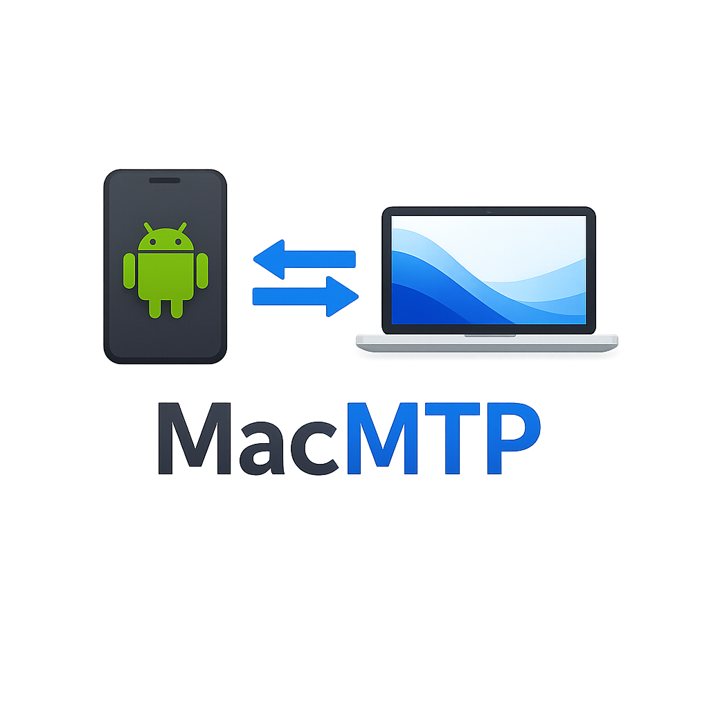
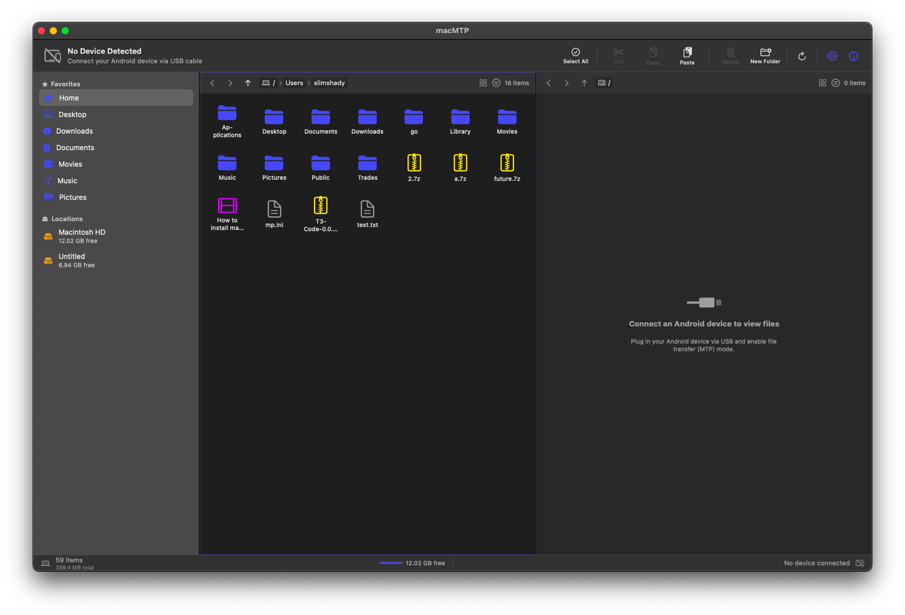
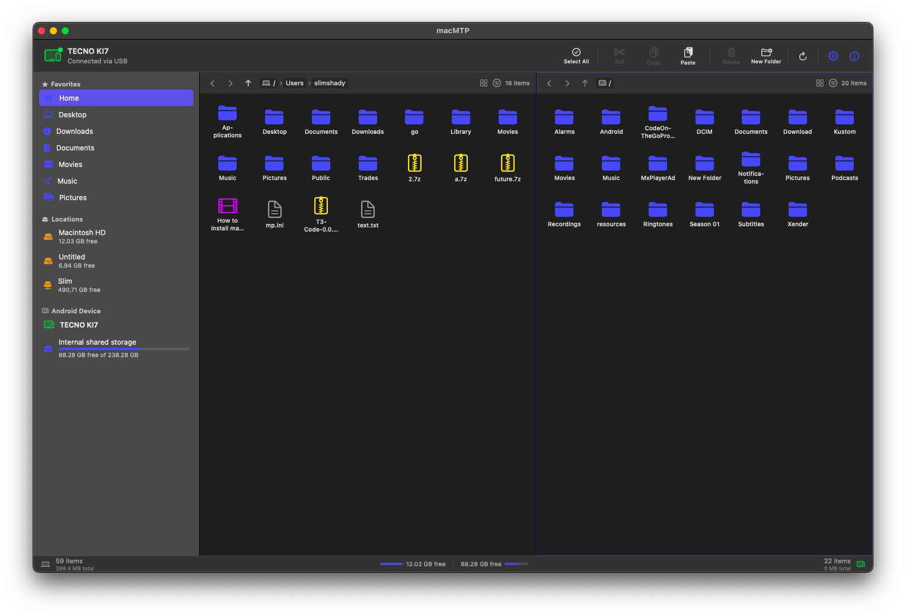
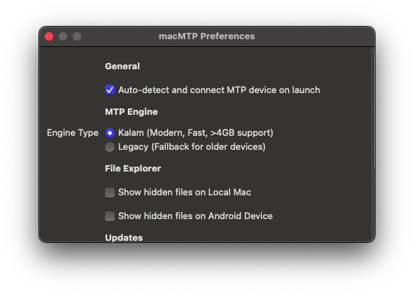
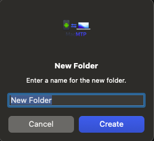
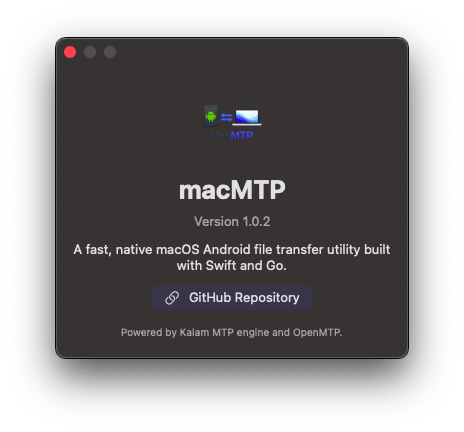

# macMTP - Native macOS Android File Transfer

<p align="center">
  
</p>

<p align="center">
  <strong>A native macOS utility for transferring files between a Mac and Android devices over USB MTP.</strong>
</p>

<p align="center">
  Built with <strong>Swift</strong> and <strong>SwiftUI</strong>. The MTP layer uses the Go-based Kalam/OpenMTP engine through a small C bridge.
</p>

<p align="center">
  <a href="https://github.com/kalabhaftu/MacMTP/actions/workflows/swift.yml">
    
  </a>
  <a href="LICENSE">
    
  </a>
  <a href="https://github.com/kalabhaftu/MacMTP/releases">
    
  </a>
  <a href="https://swift.org">
    
  </a>
  <a href="https://go.dev">
    
  </a>
</p>

---

## Screenshots

<p align="center">
  
  <br><em>Main window — no device connected</em>
</p>

<p align="center">
  
  <br><em>Main window — MTP device connected and browsing files</em>
</p>

<p align="center">
  
  <br><em>Preferences panel</em>
</p>

<p align="center">
  
  <br><em>New folder dialog</em>
</p>

<p align="center">
  
  <br><em>About macMTP</em>
</p>

---

## Why macMTP?

macMTP aims to provide a focused, native file-transfer app for people who still move files between macOS and Android devices with a USB cable. It is intentionally small: a local file pane, an MTP device pane, transfer progress, conflict handling, and packaging scripts for Intel, Apple Silicon, and universal releases.

This is community-maintained software, so this README should describe the current app rather than a wish list. If a feature below is incomplete or broken, please open an issue or PR.

---

## Current Features

### File Transfer

- USB MTP device detection through IOKit, with optional auto-connect.
- Local-to-device uploads and device-to-local downloads.
- Internal storage and SD card selection when the connected device exposes multiple MTP storages.
- Batch transfers with per-file progress, pause/resume controls for the queue, cancellation, and completion/error notifications.
- Cut/copy/paste flows across local and MTP panes.
- MTP-to-MTP copy/move is not currently supported by the bridge.

### Conflict Handling

When transferred files already exist at the destination, macMTP can ask how to handle conflicts:

| Option | Behavior |
|--------|----------|
| Overwrite All | Replace conflicting destination files with source files |
| Skip All | Keep existing destination files and skip conflicting transfers |
| Overwrite if Different | Replace only when source and destination sizes differ |
| Skip if Same Size | Keep destination files whose sizes match the source |
| Cancel | Abort the transfer |

This is size-based conflict handling. It is useful for skipping already-copied files, but it is not byte-range resume inside a partially written file.

### File Browser

- Dual-pane layout: local filesystem on the left, Android device on the right.
- Sidebar with common local folders and mounted volumes.
- List and icon views.
- Sorting by name, size, type, or modified date in list view.
- Filter bar for names or extensions such as `.mp4`.
- Hidden-file toggles for local and MTP panes.
- macOS dark mode via system colors.

### Keyboard and Selection

| Shortcut | Action |
|----------|--------|
| Letter key | Jump to the first file starting with that letter |
| Repeated letter key | Cycle through matching files |
| `Command-C` | Copy selected files |
| `Command-X` | Cut selected files |
| `Command-V` | Paste files |
| `Command-Delete` | Delete selected files |
| `Command-N` | Create new folder |
| `Command-R` | Refresh directory listing |
| `Command-A` | Select all files |
| `Enter` | Open or navigate into selected item |
| `Command-Up` | Navigate to parent folder |
| `Shift-click` | Range selection |
| `Command-click` | Toggle selection |

### Drag and Drop

- Drag files from the local pane to the MTP pane to upload.
- Drag files from the MTP pane to the local pane to download.
- Drag files from Finder into macMTP to upload to the selected MTP destination.
- Drag local files from macMTP to Finder.

Dragging MTP files directly to Finder is not implemented yet; use the local pane as the download target.

---

## System Requirements

- macOS 14.0 Sonoma or later
- Apple Silicon or Intel Mac
- USB cable connected to an Android device
- Android device set to File Transfer / MTP mode

---

## Installation

Download the latest release from the [Releases](https://github.com/kalabhaftu/MacMTP/releases) page.

Release artifacts are built for:

- `mac-arm64`
- `mac-x86_64`
- `mac-universal`

Use the universal build if you are unsure which architecture you need.

---

## Build From Source

### Prerequisites

- macOS 14.0+
- Swift 6.0+ through Xcode or Xcode Command Line Tools
- Go 1.21+
- pkg-config and libusb
- Kalam source from OpenMTP checked out next to this repository

Install the local dependencies:

```bash
brew install go pkg-config libusb
```

Clone both repositories as siblings:

```bash
git clone https://github.com/kalabhaftu/MacMTP.git
git clone https://github.com/ganeshrvel/openmtp.git
cd MacMTP
```

Build a debug app bundle for the current machine:

```bash
bash scripts/build.sh debug --arch "$(uname -m)"
open macMTP.app
```

Build a release app bundle for a specific architecture:

```bash
bash scripts/build.sh release --arch arm64
bash scripts/build.sh release --arch x86_64
```

`swift build` only works after `Sources/CKalam/libkalam.a` has been generated for the target architecture. The build script handles that step.

### Universal Builds

Universal builds require both Apple Silicon Homebrew and Intel Homebrew under Rosetta, each with `pkg-config` and `libusb` installed:

```bash
brew install pkg-config libusb
softwareupdate --install-rosetta --agree-to-license
arch -x86_64 /usr/local/bin/brew install pkg-config libusb

bash scripts/build.sh release --universal
```

### Release Packaging

Create DMG and ZIP packages for all supported targets:

```bash
bash scripts/release.sh 1.0.0 --all
```

This generates architecture-specific DMG and ZIP files plus SHA-256 checksums and `latest-mac.yml`:

```text
release/
├── macMTP-1.0.0-mac-arm64.dmg
├── macMTP-1.0.0-mac-arm64.zip
├── macMTP-1.0.0-mac-x86_64.dmg
├── macMTP-1.0.0-mac-x86_64.zip
├── macMTP-1.0.0-mac-universal.dmg
├── macMTP-1.0.0-mac-universal.zip
└── latest-mac.yml
```

---

## Architecture

```text
SwiftUI app
  ContentView, FileExplorerPane, SidebarView, transfer/progress UI
        |
Swift services and models
  ClipboardManager, FileTransferService, USBWatcher, MTPDeviceManager
        |
KalamBridge
  Swift async wrappers around C callbacks and JSON payloads
        |
CKalam
  C bridge target plus Go c-archive libkalam.a
        |
Kalam / go-mtpx / libusb
  MTP operations and USB transport
```

The Go MTP engine is compiled as a static C archive (`libkalam.a`) and linked into the Swift executable. `libusb.dylib` is bundled into the app package during scripted builds.

---

## Project Structure

```text
macmtp/
├── Package.swift
├── Sources/
│   ├── CKalam/
│   │   ├── include/
│   │   ├── early_init.c
│   │   ├── shim.c
│   │   └── libkalam.a              # generated by scripts/build.sh
│   └── macmtp/
│       ├── App/
│       ├── Models/
│       ├── MTP/
│       ├── Services/
│       ├── Utilities/
│       └── Views/
├── Resources/
├── scripts/
│   ├── build.sh
│   └── release.sh
└── .github/workflows/
```

---

## Contributing

See [CONTRIBUTING.md](CONTRIBUTING.md) for setup, code style, PR process, and areas to work on.

This project follows the [Contributor Covenant](CODE_OF_CONDUCT.md). Report security issues via [SECURITY.md](SECURITY.md).

Governance and decision-making are documented in [GOVERNANCE.md](GOVERNANCE.md).

---

## Acknowledgments

- [OpenMTP](https://github.com/ganeshrvel/openmtp)
- [go-mtpx](https://github.com/ganeshrvel/go-mtpx)
- [libusb](https://libusb.info/)
- [Sentry Cocoa](https://github.com/getsentry/sentry-cocoa)

---

## License

MIT License - see [LICENSE](LICENSE) for details.
